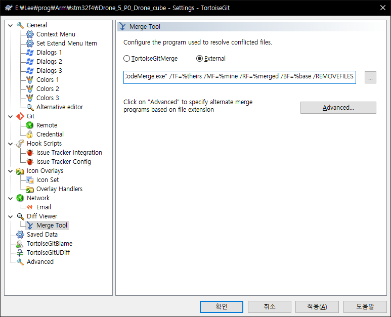
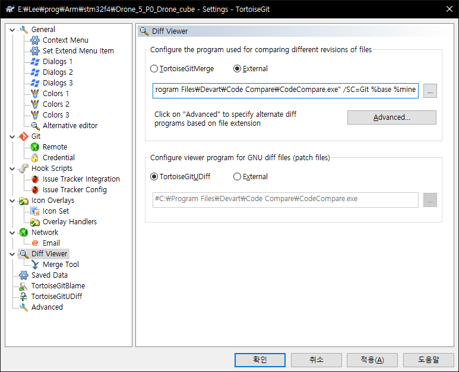

* Kramdown table of contents
{:toc .toc}

# Diff Viewer

> "C:\Program Files\Devart\Code Compare\CodeCompare.exe" /SC=Git %base %mine

# Merge Tool

> "C:\Program Files\Devart\Code Compare\CodeMerge.exe" /TF=%theirs /MF=%mine /RF=%merged /BF=%base /REMOVEFILES
